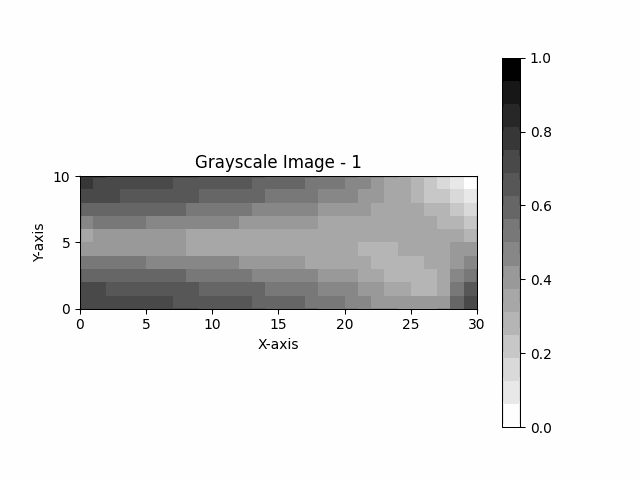
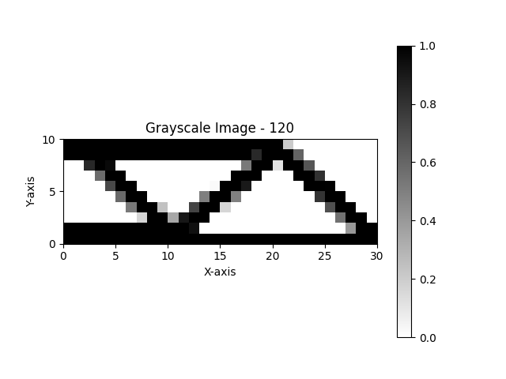

# MyTopOpt


> This is a simple makefile to build c++ program folder template.


## Getting Started 


```
git clone https://github.com/HajerZhang/MyTopOpt.git
```

### Prerequisites 

What things you need to install the software and how to install them

```
python3 with numpy, matplotlib， PIL，tqdm
```
(maybe future will use [eigen3](https://gitlab.com/libeigen/eigen/-/releases/3.4.0))
### Installation 

How to use

Windows  & Linux:

```sh
make
```
Debug mode:

```sh
make debug
```
How to run:

```sh
./main.exe
```
How to plot the result:

```sh
python3 plot.py
```

### Usage example 

Topology optimization of 2D MBB beam:

Gif of the process:



The final result:



## Deployment 

Install the python3 and the required packages, then run the plot.py to create the topology optimization result in file './plot'.

## Release History 
* 2.5
    * Fixed a lot of bugs in version 2.0 which is now working properly
* 2.0
    * Change the code structure, use the faster finite element method.
    * Replace the <strong>OC</strong> method with the <strong>MMA</strong> method.
    * Add the density filter. 
* 1.0
    * inital version：Basic 2D topology optimization
    * Python：Draw the topology optimization diagram with matplotlib
## Planned update
* Improved operational efficiency (sparse matrix)
* Heaviside function
* Stress constraint
* 3D topology optimization
## Authors 

* **Hajer** - *main worker* - [Hajer Zhang](https://github.com/HajerZhang)
* **Teng Qing** - *technical adviser* - [SZWHTQ](https://github.com/SZWHTQ)

To see more about the contributors to this project, please read [contributors](https://github.com/HajerZhang/MyTopOpt/graphs/contributors) 


## Reference

* Sigmund O (2001) A 99 line topology optimization code written in Matlab. Struct Multidiscip Optim
21(2):120–127
* Andreassen E, Clausen A, Schevenels M, Lazarov BS, Sigmund O
(2011) Efficient topology optimization in matlab using 88 lines of
code. Struct Multidiscip Optim 43(1):1–16

## License 

This project has no license now，but it will be MIT licensed in the future.


